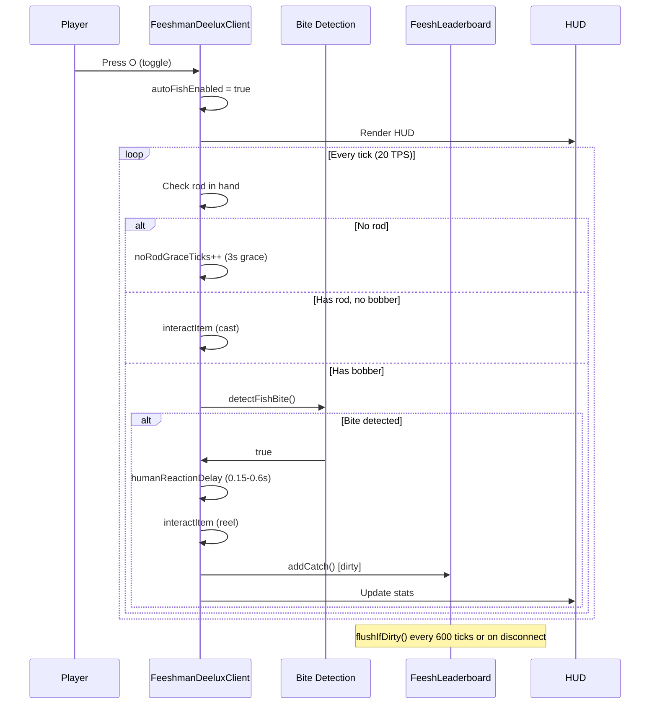
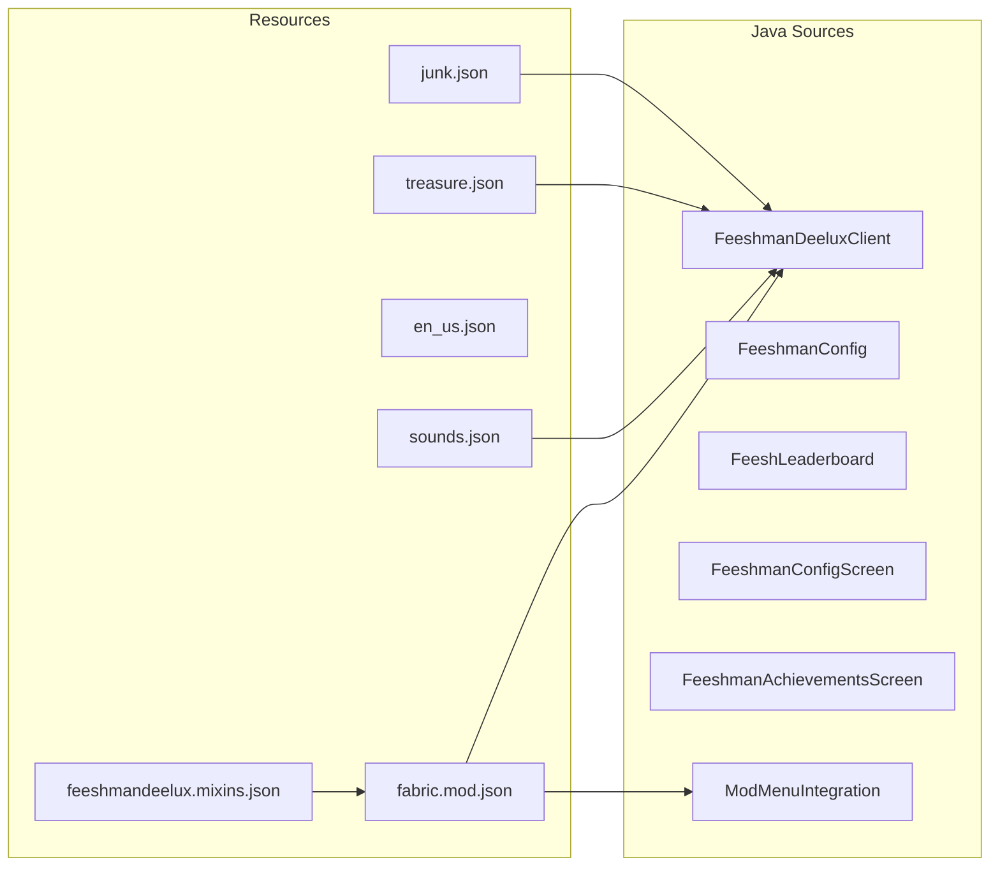

<!-- PRESERVATION RULE: Never delete or replace content. Append or annotate only. -->

# ARCHITECTURE

## System Overview

```
┌─────────────────────────────────────────────────────────────────────────┐
│  Feeshman Deelux — Server-First Architecture (1.21.11)                  │
├─────────────────────────────────────────────────────────────────────────┤
│  Server: AutoFishService, Commands, Payloads → S2C sync                  │
│  Client: HUD, Bite sound, Item announcements, Achievement toasts         │
│  Vanilla clients: Auto-fish + commands only (no HUD/sounds)             │
└─────────────────────────────────────────────────────────────────────────┘
```

## Component Diagram

```mermaid
flowchart TB
    subgraph Entrypoints
        Main[FeeshmanMod]
        Client[FeeshmanDeeluxClient]
        ModMenu[ModMenuIntegration]
    end

    subgraph Server
        Main --> AutoFish[AutoFishService]
        Main --> ServerCmds[FeeshmanServerCommands]
        Main --> Net[FeeshmanNetworking]
    end

    subgraph Client
        Client --> Config[FeeshmanConfig]
        Client --> Leaderboard[FeeshLeaderboard]
        Client --> HUD[HUD Renderer]
        Client --> Payloads[Payload Receivers]
    end

    subgraph UI
        ModMenu --> ConfigScreen[FeeshmanConfigScreen]
        ConfigScreen --> AchievementsScreen[FeeshmanAchievementsScreen]
    end

    subgraph Fabric
        KeyBind[KeyBinding O]
        HudCallback[HudRenderCallback]
        JoinEvent[ClientPlayConnectionEvents.JOIN]
        DisconnectEvent[ClientPlayConnectionEvents.DISCONNECT]
        TickEvent[ClientTickEvents.END_CLIENT_TICK]
    end

    Client --> KeyBind
    Client --> HudCallback
    Client --> JoinEvent
    Client --> DisconnectEvent
    Client --> TickEvent

    Config --> ConfigScreen
    Leaderboard --> AchievementsScreen
```



## Data Flow



## Module Structure



## Key Responsibilities

| Component | Responsibility |
|-----------|----------------|
| **FeeshmanDeeluxClient** | Client UX: keybinds, HUD, payload receivers (bite sound, stats, item announcements, toasts) |
| **AutoFishService** | Server auto-fish: bite detection (HOOKED_IN_ENTITY), reel, inventory diff, payload sending |
| **FeeshmanNetworking** | Payload registration (FishCaught, StatsSync, DurabilityWarning, ItemAnnouncement) |
| **FeeshmanConfig** | Load/save `feeshman-deelux.properties` (bite volume, auto-fish default) |
| **FeeshLeaderboard** | Persistent leaderboard in `feeshman-leaderboard.properties`; batch flush |
| **FeeshmanConfigScreen** | ModMenu config UI (volume slider, achievements button) |
| **FeeshmanAchievementsScreen** | Achievement list with progress from client getters |
| **ModMenuIntegration** | ModMenu entry point → ConfigScreen |

## Event Registration

| Event | Handler |
|-------|---------|
| `ClientTickEvents.END_CLIENT_TICK` | Main loop: toggle, recast, bite detection, stuck/mob checks, leaderboard flush |
| `ClientPlayConnectionEvents.JOIN` | Load lifetime from leaderboard, reset session, welcome message |
| `ClientPlayConnectionEvents.DISCONNECT` | `FeeshLeaderboard.flushIfDirty()` |
| `HudRenderCallback.EVENT` | `renderPolishedHUD()` when auto-fish enabled |
| `ClientCommandRegistrationCallback` | `/feeshman`, `/feeshstats`, `/feeshstats biome`, `/feeshleaderboard` |
